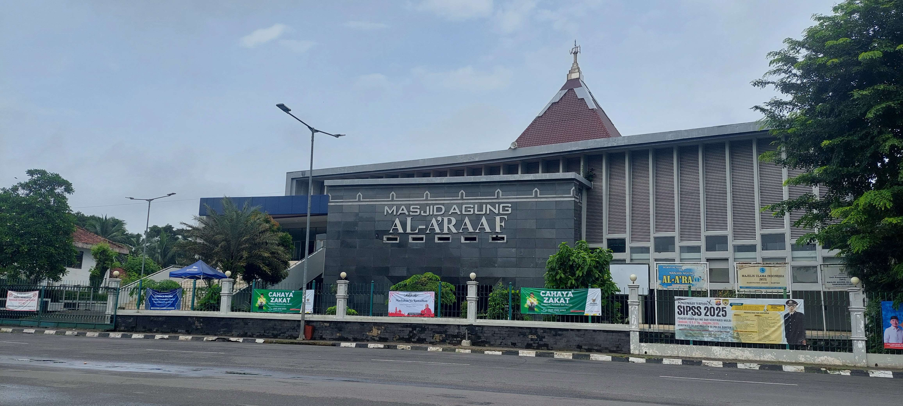
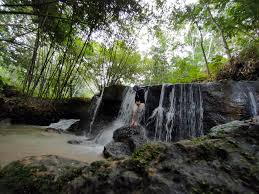
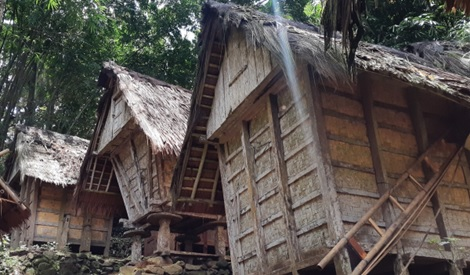
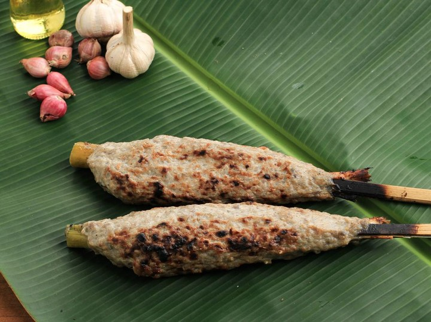
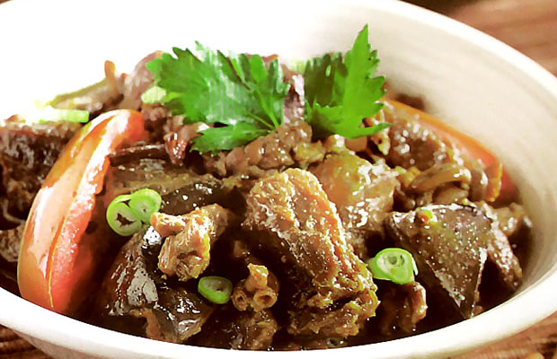

# Rangkasbitung - Kota Seribu Bambu



Website resmi pariwisata Rangkasbitung, kota yang dikenal sebagai "Kota Seribu Bambu". Website ini menampilkan informasi tentang sejarah, tempat wisata, dan kuliner khas Rangkasbitung.

## Fitur

- **Beranda** - Halaman utama dengan tampilan visual menarik
- **Sejarah** - Mengenal sejarah Rangkasbitung
- **Wisata** - Daftar tempat wisata populer di Rangkasbitung
- **Kuliner** - Kuliner khas Rangkasbitung yang wajib dicoba

## Galeri

### Tempat Wisata


*Curug Bidadari - Salah satu air terjun indah di Rangkasbitung*


*Rumah Kasepuhan - Warisan budaya Rangkasbitung*

### Kuliner Khas


*Sate Bandeng - Makanan khas Rangkasbitung*


*Rabeg - Makanan tradisional khas Banten*

## Teknologi yang Digunakan

- HTML5
- CSS3 (dengan Flexbox dan Grid)
- Google Fonts (Poppins)
- Desain Responsif

## Cara Menjalankan

1. Clone repository ini:
   ```bash
   git clone https://github.com/SEHANDIKITRIANSYAH12/DicodingPemogramanweb.git
   ```

2. Buka file `index.html` di browser favorit Anda

## Struktur Proyek

```
TUGASAKHIRWEB/
├── css/
│   └── styles.css
├── img/
│   ├── Rangkasbitung.jpeg
│   ├── curugbidadari.jpeg
│   ├── fotosehan.jpeg
│   ├── rabeg.jpeg
│   ├── rumahkasepuhan.jpg
│   ├── satebandeng.jpeg
│   └── sejarahrangkasbitung.jpg
└── index.html
```

## Kontribusi

Kontribusi terbuka untuk pengembangan website ini. Silakan buat Pull Request dengan perubahan yang diusulkan.

## Lisensi

[MIT License](LICENSE)
